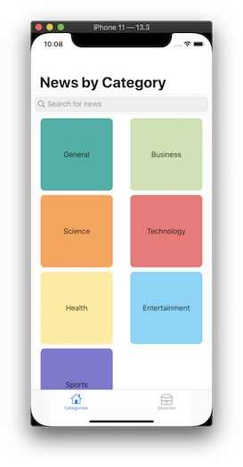
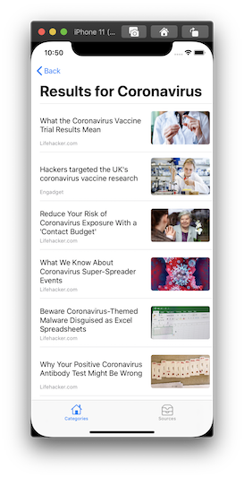

# Get News App
An iOS app to retrieve and display the latest headlines from the [News API](https://newsapi.org/)

## Description
This app grabs the lastest news headlines from the [News API](https://newsapi.org/) along with associated images by various methods. Users are able search for desired articles within the News API or get headlines based on the category. They also have the option to view the current top headlines from a list of news sources. 

### Features 
* Home Screen - get news by category or search for news
* News Sources Screen - get news by sources with ability to filter desired sources and sort by its category with animation
* Headlines Screen - displays a list of headlines along with their images with pagination of up to 100 headlines (API's limit)
* Webview Screen - renders the webpage of the headline

### App Screenshots
  
  

### Run Locally
Project code can be viewed locally and run in Xcode's simulator by cloning or downloading this [repo](https://github.com/caocmai/get-news-app.git).

## Built With
* [Xcode - 11.3.1](https://developer.apple.com/xcode/) - The IDE used
* [Swift - 5.1.4](https://developer.apple.com/swift/) - Programming language
* [Kingfisher - 5.14.0](https://github.com/onevcat/Kingfisher) - 3rd party library

## Author
* Cao Mai - [Portfolio](https://www.makeschool.com/portfolio/Cao-Mai)


## License
This project is licensed under the MIT License - see the [LICENSE](LICENSE) file for details

## Note
Without your own person API key from the [News API site](https://newsapi.org/) this app will not work!

Inside this project contains a file called "Secret.swift", which contains my personal API key to the [News API](https://newsapi.org/). When cloning this project you must create that file and add your own API key to be able to run the project. You can get a free API key from the [News API website](https://newsapi.org/). 

Also, if the file "Secret.swift" is already there when cloning this project, delete it, save, and recreate that file along with the following code snippet: 

Inside your Secret.swift file you should add the following:

```swift
enum Secret: String {
case apiKey = "your unique personal API key goes inside these quotes"
}
```
