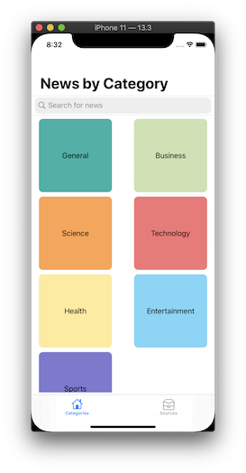
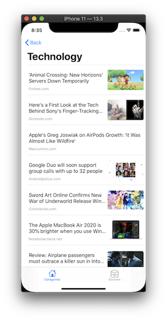
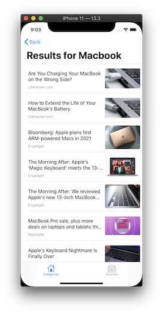
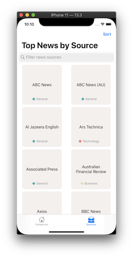
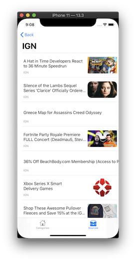
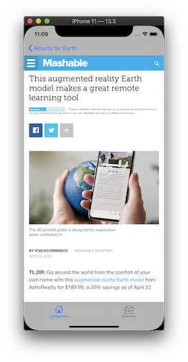

# Get News App
An iOS app to retrieve and display the latest headlines from the News API

## Description
This app grabs the lastest headlines from the [News API](https://newsapi.org/) along with associated images by various methods. Users are able search for desired articles within the News API or get headlines based on the category. They also have the option to view the current top headlines from a list of news sources. 

### Features 
* Home Screen - get news by category or search for news
* News Sources Screen - get news by sources with ability to sort by the category of the sources
* Headlines Screen - displays a list of headlines along with their images
* Webview Screen - renders the webpage of the headline

### App Screenshots
  
  

### Run Locally
Project code can be viewed locally and run in Xcode's simulator by cloning/downloading or forking this repo.

## Built With
* [Xcode - 11.3.1](https://developer.apple.com/xcode/) - The IDE used
* [Swift - 5.1.4](https://developer.apple.com/swift/) - Programming Language

## Author
* Cao Mai - portfolio can be found at:
https://www.makeschool.com/portfolio/Cao-Mai

## License
This project is licensed under the MIT License - see the [LICENSE.md](LICENSE.md) file for details

## Note
This project contain a file called "Secret.swift", which contains my personal API key to the [News API](https://newsapi.org/). When cloning this project you must create that file and add your own API key to be able to run the project. 

Inside the Secret.swift file you should add the following:

enum Secret: String {  
    case apiKey = "your unique API key goes here"  
}
